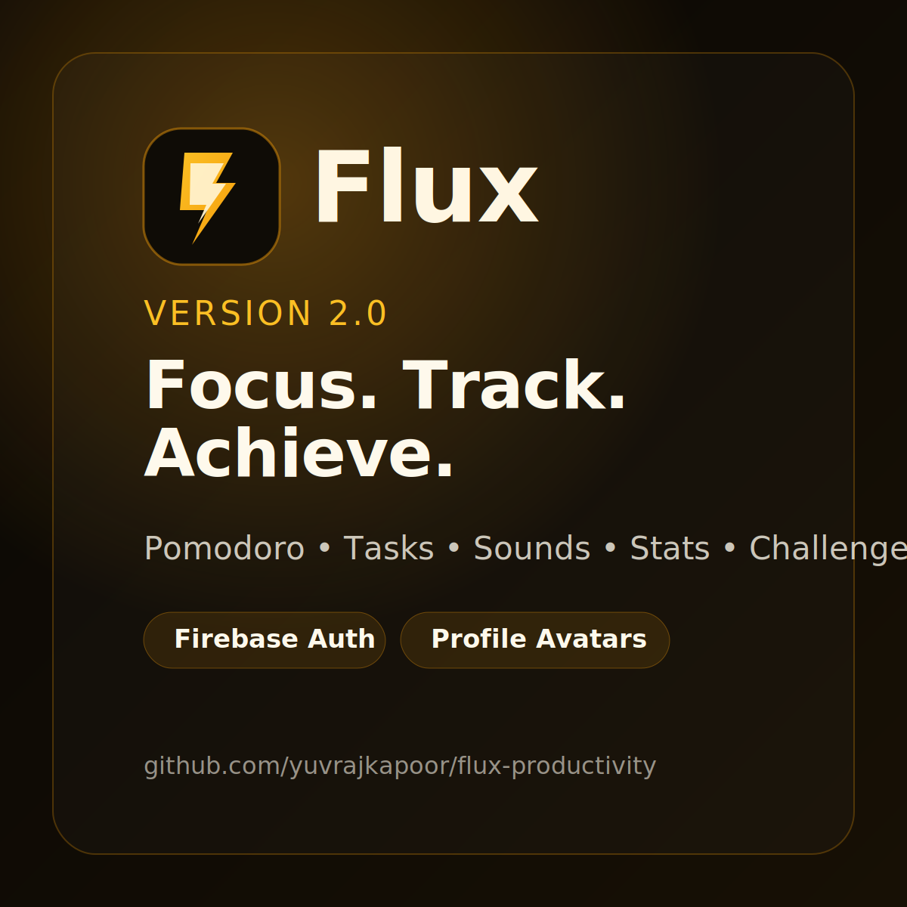

# Flux Productivity

Flux is a focused productivity workspace for Pomodoro sessions, tasks, stats, and live leaderboard presence.

## Project Snapshot
- Vanilla HTML, CSS, and JavaScript
- Firebase Authentication for sign-in flows
- Firestore for leaderboard and presence sync
- Static deployment with Vercel

## Dependencies
- `serve` for local static hosting
- `puppeteer` and `puppeteer-extra` for smoke and E2E checks
- `lighthouse` for performance and SEO audits
- `clean-css`, `html-minifier-terser`, and `terser` for the production build

## Visuals

## Live Demo
- Vercel: https://flux-productivity-nine.vercel.app/

## Notes
- Do not commit secrets or private credentials.
- Keep changes small, readable, and easy to test.
- See `CONTRIBUTING.md` if you want setup and testing guidance.
