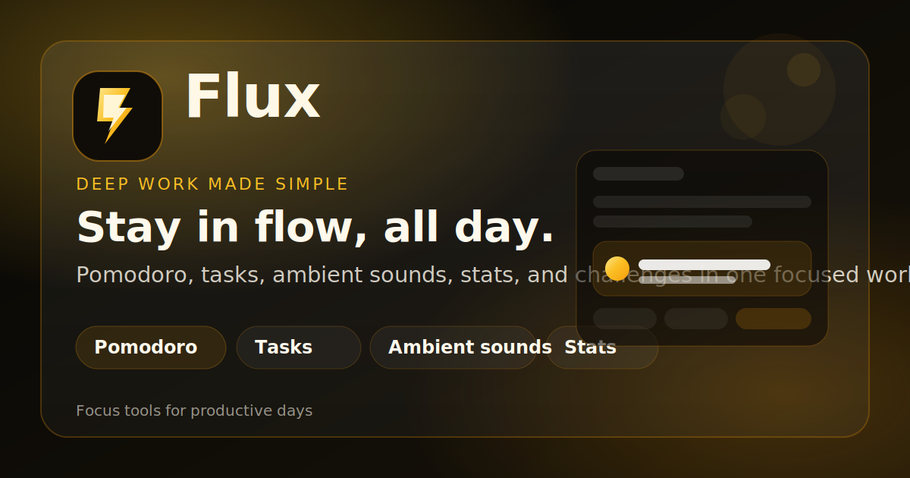

# Flux Productivity — Version 2.0



Flux is a premium productivity workspace focused on deep work, planning, and daily consistency.

Version 2.0 delivers a full visual refresh, stronger auth/profile flows, richer interactions, and improved release setup for production deployment.

## Release Assets

- Changelog: CHANGELOG.md
- Social preview (landscape): assets/social-preview.svg
- Social preview (square): assets/social-preview-square.svg

## What's New in 2.0

- Complete UI refresh with upgraded visual hierarchy, gradients, glass surfaces, and motion polish.
- New branded logo system and tab icon (favicon) for stronger product identity.
- Improved loading experiences for both app pages with smooth transitions and better synchronization.
- Hardened Firebase authentication flow with shared configuration and better error handling.
- **Guest Mode Fallback:** Automatically bypasses Firebase initialization if dummy credentials are provided.
- **Redesigned Settings & Profile UI:** Added a Bento-grid settings layout and a premium glowing profile modal.
- Profile avatar reliability fixes with robust fallback logic to prevent blank profile images.
- Better auth-to-app synchronization to avoid race conditions during startup.
- Cleaner code organization with reduced duplication in Firebase config and avatar utility logic.

## Core Features

- Google sign-in and email/password auth with friendly error states.
- Persistent sessions using local auth persistence.
- Profile management:
  - Display name, username, bio, banner themes.
  - Avatar upload, optimization, fallback generation, and removal.
  - Daily focus goal slider and profile stats strip.
- Pomodoro focus timer with customizable controls.
- Daily task management with completion tracking.
- Ambient sound mixer with volume and master controls.
- Focus statistics dashboard for streaks, sessions, and progress.
- Challenge system with active/completed/custom challenge flows.
- Theme and accent customization.
- Accessibility controls including Mute and a new **Reduced Motion** toggle.
- Performance-lite mode detection for lower-end devices.

## Tech Stack

- Frontend: Vanilla HTML, CSS, JavaScript
- Auth: Firebase Authentication (Web SDK)
- Build pipeline: html-minifier-terser, clean-css, terser

## Project Structure

- index.html: Main app shell
- login.html: Authentication entry page
- style.css: Shared styling system
- js/: Feature modules (auth, profile, tasks, timer, stats, sounds, challenges)
- assets/: Logo and favicon assets
- scripts/build-dist.mjs: Production build script

## Local Development

1. Install dependencies:

```bash
npm install
```

2. Run a local static server from project root (example):

```bash
python3 -m http.server 5500
```

3. Open in browser:

- http://localhost:5500/login.html
- http://localhost:5500/index.html

## Build for Production

```bash
npm run build
```

The optimized output is generated in dist/.

## Firebase Setup

Update configuration in js/firebase-config.js if you are using your own Firebase project.

Required fields:

- apiKey
- authDomain
- projectId
- appId

For local testing, use localhost and ensure your domain is authorized in Firebase Auth settings.

## Release Notes

Version: 2.0.0

This release focuses on visual refinement, startup/auth reliability, profile avatar correctness, and cleaner project organization for easier maintenance and deployment.

Detailed release entries are available in CHANGELOG.md.
